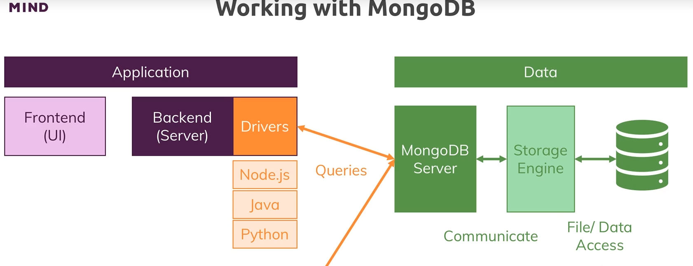
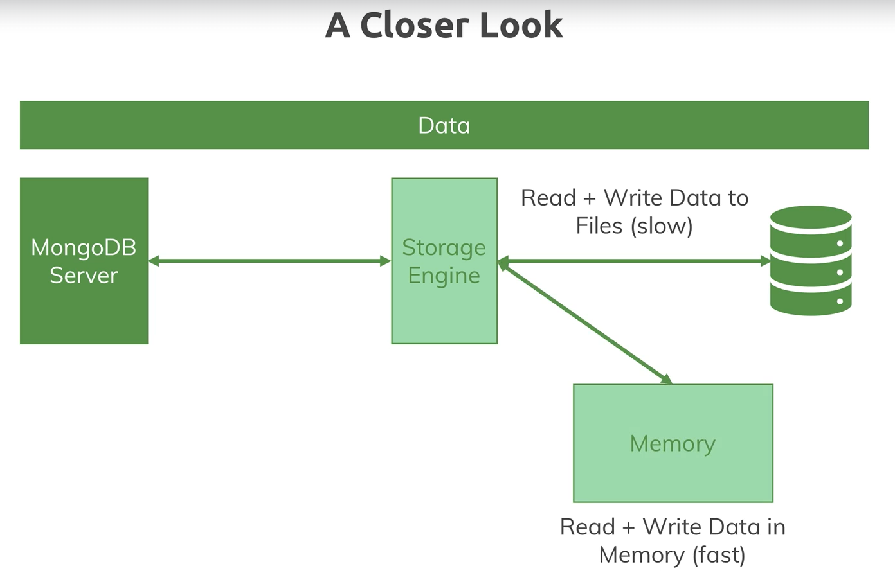
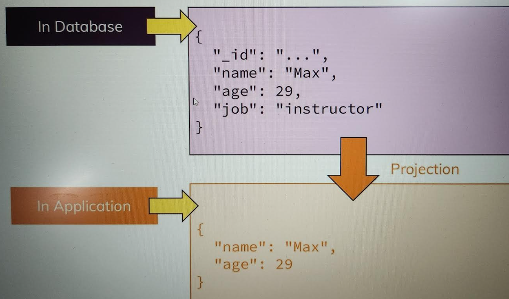
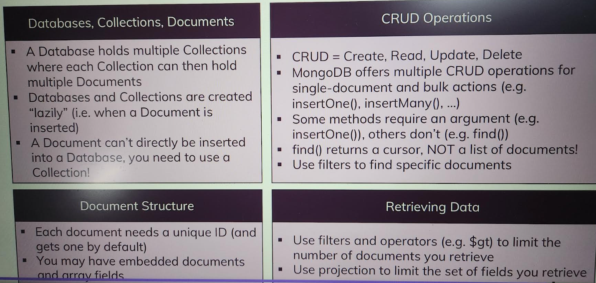

## MongoDB Intorduction

- DB engine tool that we can use to run NoSQL DB
- It is a server that allows us to run different DB on it
- It is build to store & use large data; built for large scale application, to quickly query data, store data & interact with data; mongo from work humongous
- Shop DB; Inside this we have multiple collections: Users, Orders; Inside collections we have multiple documents
- Documents are SCHEMALESS, there is no strict schema for every document inside collection
- 
- Inside document, we use JS object to store data. MongoDb use JSON(JS object notation) to store data in collections
- To be precise mongodb uses BSON for binary json which it transforms BTS(from JSON to BSON) before storing it into files
- 
- We can store nested/embdedded data(address) inside document. This allows us complex relations between data & store them in one same document which make working & fetching it super efficient
- MongoDB characteristics
  - Schemaless
  - No/Few Realtions: Relational data needs to be merged manually
- Relations Options ()
  - Nested/embedded document
    - If we have lot of data duplications, then we have to update it at all places
  - References
    - We will add reference of data in one table of another
    - We should not relate the documents too much as our queries become slow
- 
- In cmd : net stop MongoDB (stops the mongo db server); net start MongoDB (starts the server)
- After installing mongodb server & mongo shell
- In cmd -> mongosh : it will open mongo shell; show dbs : show the databses present in shell
- 
- 
- 

## BASICS & CRUD OPERATIONS

# DB, Collection, Documents

- We can have one or more DB on our DB server
- Each DB can hold one or more collections (table in SQL)
- In collection there are multiple documents (data)
- These all are created implicitly

# Creating DB & Collections

- In cmd -> mongosh
- use: use flights : if this db not exist then it will create flights db & switch to it
- insertOne : db.flightData.insertOne({ "departureAirport": "MUC", "arrivalAirport": "SFO", "aircraft": "Airbus A380", "distance": 12000, "intercontinental": true }) : insert this one object to db as document (create flightData collection also); Mongodb auto generates unique \_id
- find : db.flightData.find().pretty() : show the documents inside flightData in pretty format
- We can also manually assign \_id to document : db.flightData.insertOne({ "departureAirport": "IXC", "arrivalAirport":"PNQ", \_id:"ixc-pnq-1" })
- We cannot add 2 documents with same \_id, else it will give error
- 

# CRUD

- We have MongoDB driver for each language, Eg: for nodejs, java etc
- 
- Create
  - insertOne(data, Options): allows to insert some data to collection
  - insertMany(data, Options)
- Read
  - find(filter, options): find the documents inside collection, find all the matching documents
  - findOne(filter, options): find 1st matching document
- Update
  - updateOne(filter, data, options): to change one piece of data
  - updateMany(filter, data, options)
  - replaceOne(filter, data, options): to replace the document entirely with new one
- Delete
  - deleteOne(filter, options)
  - deleteMany(filter, options)
- 
- deletOne: db.flightData.deleteOne({departureAirport:"IXC"}): find the first document in collection with this, then it will delete that one
- updateOne: db.flightData.updateOne({distance:12000},{$set:{marker: "delete"}}): '$set' tell mongoDb to set this value for thr specified filter
- updateMany: db.flightData.updateMany({}, {$set:{marker:'toDelete'}}): updated all the documents; If marker already exists in document it will be replace & if not present then added to document
- deleteMany: db.flightData.deleteMany({marker:'toDelete'}) : delete documents with this filter
- insertMany: db.flightData.insertMany([ { "departureAirport": "MUC", "arrivalAirport": "SFO", "aircraft": "Airbus A380", "distance": 12000, "intercontinental": true }, { "departureAirport": "LHR", "arrivalAirport": "TXL", "aircraft": "Airbus A320", "distance": 950, "intercontinental": false }]): passed array of objects.
- find(): db.flightData.find({intercontinental:true}).pretty()
- find() with greater than filter: db.flightData.find({distance:{$gt:10000}}): '$gt' is greater than; '$lt' is less than, query gives all the document with filter
- findOne(filter): give 1st document that matches the filter
- if we paas {} as filter it means we want all the data in that case
- updateOne: db.flightData.updateOne({\_id:ObjectId('665d4d4bcf2442da28cdcdf8')}, {$set: {"delayed":true}}) : Update one element based on filter
- updateMany: db.flightData.updateMany({\_id:ObjectId('665d4d4bcf2442da28cdcdf8')}, {$set: {"delayed":false}}) : update for all
  updateMany:
- update is deprecated
- replaceOne: db.flightData.replaceOne({ \_id: ObjectId('665d4d4bcf2442da28cdcdf8') }, { departureAirport: 'MUC', arrivalAirport: 'SFO', aircraft: 'Airbus A380', distance: 20000, intercontinental: true, delayed: false }): replaces the entire document mathching the query
- If we insert many documents in passengers using insertMany
- find(): it gives back cursor object; we can use 'it' command in shell to see all the data as find does not show all data
- find does not return array of all docs in collection it gives only 20items as collection can be very big if it has 20M data then it will take very long time to get data & will send lot of data therefore it gives cursor object which is an object which have lot of meta data behind it that allows us to cycle through results
- toArray: db.passengers.find().toArrray() : it exhaust the cursor & fetch all docs from collection or we can use forEach as db
- passengers.find().forEach((passengerData)=>{printjson(passengerData)})
- forEach will fetch the next doc on every loop cycle so it is very efficient as it does not fetch all data in advance & load in memory instead it fetches data on demand not overusing our bandwidth & not loading too much in memory therefore pretty does not work on findOne as pretty method exists only on cursor
- Projection: If there is more data in database document but in application we only need few data of document, it is better to filter the data on mongodb server only by using Projection otherwise in application it will take more memory & bandwidth
- 
- db.passengers.find({}, {name:1}).pretty(): projection of name is added it will return name & \_id , \_id is special field in data by default its always included, if we dont want \_id we have to explicilty mention it
- db.passengers.find({}, {name:1, \_id:0}).pretty() : will not return \_id in documents result
- Structured data : embedded docs, arrays
- Embedded documents or nested documents are those types of documents which contain a document inside another document. We can have up to 100 levels of nexting & max 16mb/document
- Arrays of embedded documents but arrays can hold ANY data, simply means list of data
- db.flightData.updateMany({}, {$set:{status:{description:"on-time", lastUpdated: "1 hour ago"}}}) : added nested data; now flightData will have embedded document
- db.flightData.updateMany({}, {$set:{status:{description:"on-time", lastUpdated: "1 hour ago", details:{responsible:"Reema"}}}}): more embedded doc now
- db.passengers.updateOne({name:'Reema'}, {$set:{hobbies:["sleeping", "eating", "cooking"]}}) : adding arrays
- Accessing Structured data
- db.passengers.findOne({name:'Reema'}).hobbies: to get array
- db.passengers.findOne({hobbies:'cooking'}): to get the document with specific array elt
- db.flightData.find({"status.details.responsible":"Reema"}): accessing embedded document
- 
- https://docs.mongodb.com/ecosystem/drivers/
- https://docs.mongodb.com/manual/tutorial/getting-started/
  MongoDb enforeces no schemas! But that does not means that we can't use some kind of schema
